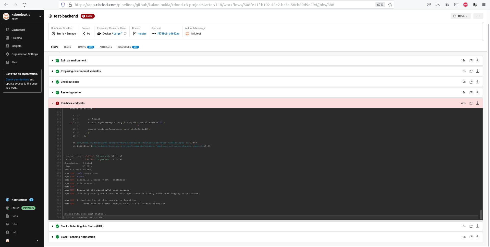
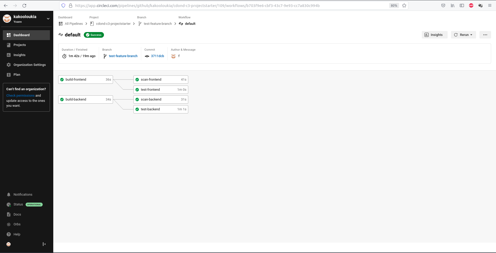

## Give your Application Auto-Deploy Superpowers

In this project, you will prove your mastery of the following learning objectives:

- Explain the fundamentals and benefits of CI/CD to achieve, build, and deploy automation for cloud-based software products.
- Utilize Deployment Strategies to design and build CI/CD pipelines that support Continuous Delivery processes.
- Utilize a configuration management tool to accomplish deployment to cloud-based servers.
- Surface critical server errors for diagnosis using centralized structured logging.

### Instructions

* [Selling CI/CD](instructions/0-selling-cicd.md)
* [Getting Started](instructions/1-getting-started.md)
* [Deploying Working, Trustworthy Software](instructions/2-deploying-trustworthy-code.md)
* [Configuration Management](instructions/3-configuration-management.md)
* [Turn Errors into Sirens](instructions/4-turn-errors-into-sirens.md)

### Project Submission

For your submission, please submit the following:

- A text file named `urls.txt` including:
  1. Public Url to GitHub repository (not private) URL01: https://github.com/kakooloukia/nd9991-c3-hello-world-exercise-solution
  1. Public URL for your S3 Bucket (aka, your green candidate front-end) URL02: s3://udapeople-95e50d9
  1. Public URL for your CloudFront distribution (aka, your blue production front-end) URL3: http://d20i74zs69utph.cloudfront.net/
  
  1. Public URLs to deployed application back-end in EC2 URL04: http://18.234.140.157:3030
  1. Public URL to your Prometheus Server URL05: http://ec2-54-173-242-20.compute-1.amazonaws.com:9090
- Your screenshots in JPG or PNG format, named using the screenshot number listed in the instructions. These screenshots should be included in your code repository in the root folder.
  1. Job failed because of compile errors. 
  1. Job failed because of unit tests. 
  1. Job that failed because of vulnerable packages. 
  1. An alert from one of your failed builds. 
  1. Appropriate job failure for infrastructure creation. 
  1. Appropriate job failure for the smoke test job. 
  1. Successful rollback after a failed smoke test. 
  1. Successful promotion job. 
  1. Successful cleanup job. 
  1. Only deploy on pushed to `master` branch. 
  1. Provide a screenshot of a graph of your EC2 instance including available memory, available disk space, and CPU usage.
  
  
  
  1. Provide a screenshot of an alert that was sent by Prometheus.
  
  

- Your presentation should be in PDF format named "presentation.pdf" and should be included in your code repository root folder.

Before you submit your project, please check your work against the project rubric. If you haven’t satisfied each criterion in the rubric, then revise your work so that you have met all the requirements.

### Built With

- [Circle CI](www.circleci.com) - Cloud-based CI/CD service
- [Amazon AWS](https://aws.amazon.com/) - Cloud services
- [AWS CLI](https://aws.amazon.com/cli/) - Command-line tool for AWS
- [CloudFormation](https://aws.amazon.com/cloudformation/) - Infrastrcuture as code
- [Ansible](https://www.ansible.com/) - Configuration management tool
- [Prometheus](https://prometheus.io/) - Monitoring tool

### License

[License](LICENSE.md)
